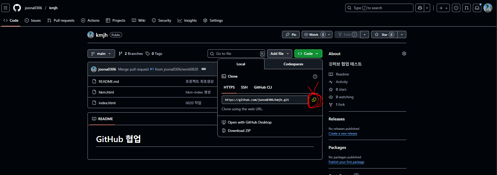
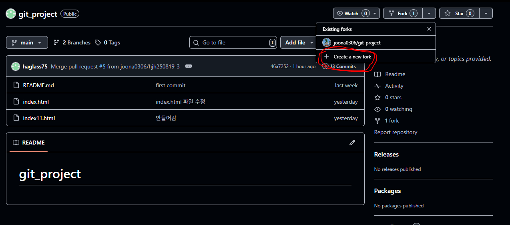
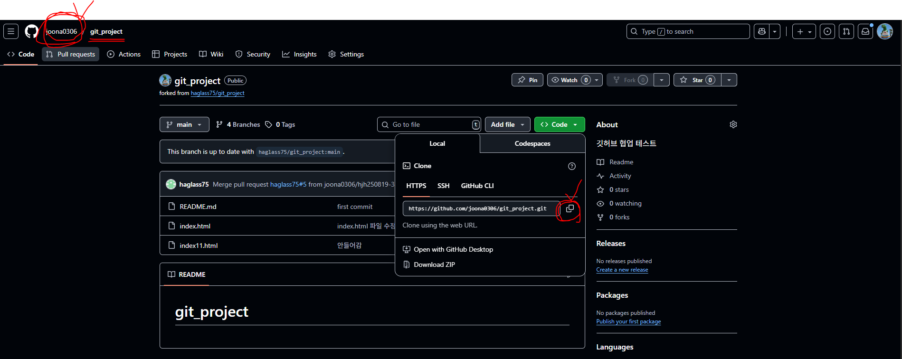
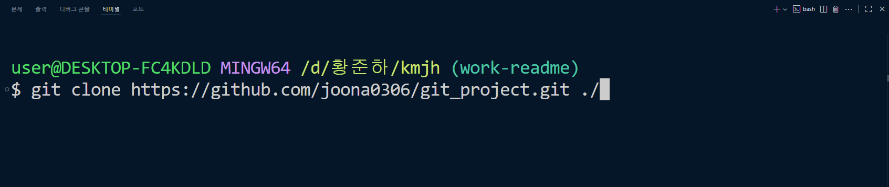
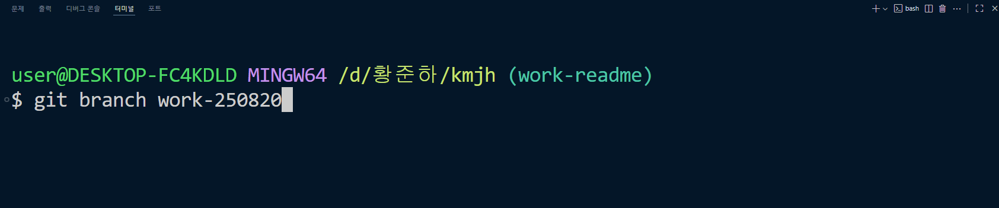
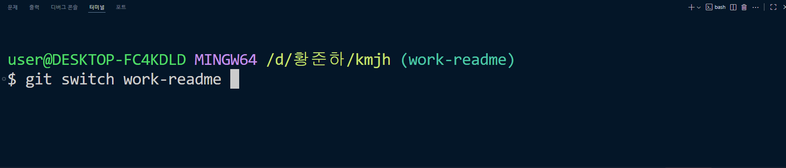
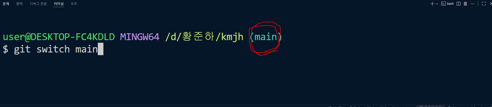

# GitHub 협업하기 순서

## 1. 팀장: 프로젝트 최초 생성

1. GitHub 새로운 레포지토리 생성

- 마지막 세줄 복사

2. 새로운 프로젝트 폴더를 생성 후 GitHub에 푸시하기

- git init
- git add .
- git commit -m "커밋 내용"
- 레포지토리에서 복사한 마지막 세줄 터미널에 붙여 넣고 엔터

3. 레포지토리 주소 팀원에게 공유

## 2. 팀원: 레포지토리 fork

1. 팀장 레포지토리에서 Create a new fork

2. fork 한 레포지토리에서 주소 복사, 이 때 본인 계정인지 꼭 확인하기

3. 새로운 폴더(프로젝트) 만들기, 되도록 레포지토리명과 같게 하기
4. 프로젝트 VSCode에서 열기
5. 터미널에서 레포지토리 clone 하기

## 3. 작업 하기 (팀장, 팀원 공통)

1. 새로운 branch 생성

2. 해당 branch로 switch 하기 (main에서 해당 branch로 바뀐 것 꼭 확인)

3. 작업 후 commit 하기

- git add .
- git commit -m "커밋 내용"
- git push origin 작업한 브랜치명

- 각자 본인 레포지토리에서 Compare & Pull requests 클릭 후 Pull request 하기

## 4. 팀장: Pull requests 목록에 팀원들 소스 머지 해주기

- 주의: 모든 팀원들이 Pull requests 완료 한 후 한꺼번에 머지 하기

## 5. 팀원: 본인 레포지토리에서 최신 소스로 업데이트 하기

- Sync fork 클릭 후 Update branch 클릭하여 최신상태로 업데이트 하기

## 6. VSCode에서 최신 소스로 fetch 후 이어서 작업하기

1. git switch main 명령으로 main 브랜치로 변경하기

2. 최신 소스로 업데이트 및 병합하기

- git fetch 또는 git fetch --all
- git merge origin/main

3. 이전에 작업한 브랜치 지우기

- git branch -d 브랜치명

4. 새로운 브랜치 생성

- git branch 새로운 브랜치명
- git switch 새로운 브랜치명

5. 이어서 작업 후 위 순서 반복
